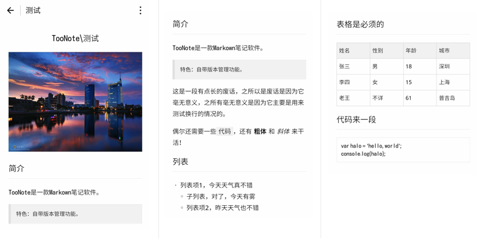

# wemark - 微信小程序Markdown渲染库

[](https://travis-ci.org/TooBug/wemark)




## 背景和功能

用于在小程序中渲染Markdown文本。

在小程序诞生之前，Markdown的渲染一般需要解析成HTML，然后渲染解析后的HTML。然而小程序并没有提供HTML渲染的功能，因此在wemark诞生之前，几乎所有的Markdown渲染库全部无法在小程序下正常工作。

wemark可以实现在小程序下渲染Markdown内容，支持图片、表格在内的大部分Markdown特性。

## 特性

- 以小程序自定义组件形式提供，可直接引入使用
- 支持大部分markdown标记的解析、渲染（详细支持情况见下方附录）
- 支持代码表格、代码高亮、HTML视频等特性
- 支持使用原生`rich-text`进行渲染
- 兼容mpvue等开发框架

## 使用方式

1. 下载并拷贝`wemark`目录到小程序根目录
2. 在页面的配置文件中引用`wemark`组件
	```json
	{
		"usingComponents": {
			"wemark": "../wemark/wemark"
		}
	}
	```
3. WXML中使用：`<wemark md="{{md}}" link highlight type="wemark"></wemark>`

> 详细代码可见`demo`目录，该目录是一个完整的小程序“代码片段”项目，可在wemark根目录先运行`npm run copy`，然后添加到微信开发者工具的“代码片段”中进行体验。

参数说明：

- `md`，必填，需要渲染的Markdown字符串；
- `link`，是否解析链接，如果解析，会使用小程序`navigator`组件展现，可在小程序内跳转，默认为`false`；
- `highlight`，是否对代码进行高亮处理，默认为`false`；
- `type`，渲染方式，`wemark`会使用`wemark`的数据结构和模板进行渲染，`rich-text`会使用小程序内置的`rich-text`组件进行渲染（不支持链接跳转、视频）。

> 注：代码高亮会使标签数量和解析后的数据量增大，不排除产生渲染性能问题，请根据实际需要酌情使用。

## 其它框架中使用

### mpvue

mpvue支持引入微信自定义组件，可在页面的`.js`文件中添加配置，引用`wemark`，然后在`.vue`文件的`template`部分直接使用`wemark`：

```javascript
export default {
  config: {
    // 这儿添加要用的小程序组件
    usingComponents: {
      wemark: '../../static/wemark/wemark'
    }
  }
}
```

```html
<wemark :md="md" link highlight type="wemark"></wemark>
```

> 注：为了让mpvue打包时能把`wemark`包一并打包到`dist`目录，建议将`wemark`放置在源码`static`目录下。

本项目`mpvue`目录中包含完整的mpvue小程序演示项目，可在`wemark`根目录运行`npm run copy`，然后在微信开发者工具中打开使用。

### taro

update: taro 1.0.0-beta6已支持引入自定义小程序，但是代码高亮的样式引用有问题。<https://github.com/TooBug/wemark/issues/36>

~~由于taro官方还不支持直接引用自定义小程序组件，因此无法直接使用2.0版本，可以参考基于1.x封装的项目<https://github.com/kapeter/taro-wemark>（非官方）。~~

后续taro更新时，wemark会及时跟进。

## 附：特性

- 标题
- 段落
- 代码段（可高亮）
- 引用
- 无序列表
- 有序列表
- 粗体
- 强调（斜体）
- 删除线
- 行内代码
- 图片
- 表格
- HTML标记
	- 视频

## 测试

```shell
npm install
npm test
```

## 开源协议

MIT

## 用户列表

- [TooNote](https://xiaotu.io)
- [王者荣耀早知道](https://www.wxappr.com/app/1449)
- [有的选](https://www.damengxiang.me/app/724e3131.html)
- [群里有事](http://www.ifanr.com/minapp/843889) （目测 尝试联系作者确认，没有回应）

如果你也使用了 wemark，欢迎提 PR 将自己的小程序加入列表

## 版本记录

### v2.0.0-beta2 2018-08-18

- 修复HTML代码高亮的bug #39

### v2.0.0-beta1 2018-07-12

- 重构代码，使用小程序自定义组件发布，兼容mpvue #34 #32 #24
- 支持代码高亮 #25
- 支持链接解析，在小程序内跳转 #37
- 支持使用小程序富文本组件`rich-text`渲染
- 支持“双空格+回车”的软换行渲染 #29

### v1.2.3 2018-07-05

- 支持缩进形式的代码段 #31 by kapeter
- 修复“##”后不加空格和文字时渲染出错的问题 #27

### v1.2.2 2018-01-30

- 修复小程序框架更新后数组判断失效导致渲染失败的问题 #17

### v1.2.1 2017-07-24

- 支持使用`video[poster]`属性添加视频封面图 #15 by @kilik52

### v1.2.0 2017-06-30

- 一些渲染细节样式修正 #9 #10
- 图片渲染使用`widthFix`模式，不再动态计算高度 #11 #12
### v1.1.0 2017-01-22

- 添加删除线渲染（`~~deleted~~`）
- 添加HTML视频解析（需求&初始实现 by @littledu）
- 解析功能补齐自动测试

### v1.0.0 2016-12-12

- 基本功能
