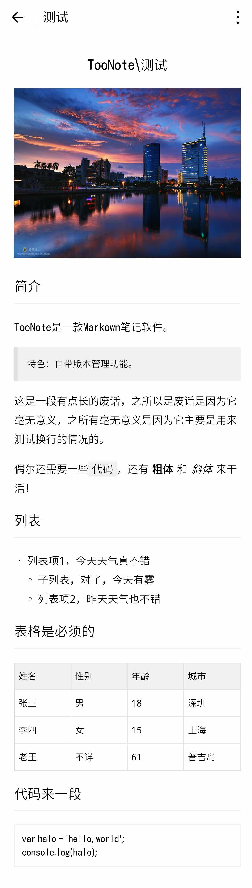

# wemark - 微信小程序Markdown渲染库

[](https://travis-ci.org/TooBug/wemark)




## 背景和功能

用于在小程序中渲染Markdown文本。

众所周知，Markdown的渲染一般需要解析成HTML来渲染。然而小程序并没有提供HTML渲染的功能，甚至连利用JS动态创建UI元素都不可能。因此所有的Markdown渲染库全部无法在小程序下正常工作。

本库可以实现在小程序下渲染Markdown内容，支持图片、表格在内的大部分Markdown特性。

## 使用方式

### 1. 准备工作：

1. 下载并拷贝`wemark`目录到小程序根目录
2. WXSS中引用样式：`@import '../wemark/wemark.wxss'`
3. WXML中引用结构：`<import src="../wemark/wemark.wxml"/>`
4. JS中引用`wemark`：`var wemark = require('wemark')`

### 2. JS部分

首先需要确定一个用于`wemark`渲染使用的数据名称（默认情况下为`wemark`），然后在页面的`data`中指定：

```javascript
page({
	data:{
		// 确定一个数据名称
		wemark:{}
	}
});
```

接下来在`Page`的生命周期函数（如`onReady`）中，调用`wemark.parse(md, this, options)`即可。

具体的参数说明：

- `md`，必填，需要渲染的Markdown字符串
- `this`，必填，`Page`实例
- `options`，其它的参数
	- ~~`imageWidth`，图片的宽度，如包含图片，则为必填，以`px`为单位~~ 新版小程序图片可以自适应宽高
	- `name`，对应上面指定的数据名称，默认为`wemark`

### 3. WXML部分

```html
// data中的参数和上方确定的数据名称保持一致
<template is="wemark" data="{{...wemark}}"></template>
```

### 实例

```javascript
// 引入wemark
var wemark = require('../wemark/wemark');
// 需要渲染的Markdown文本
var md = '# hello, world\n\nI love you, wemark!';


Page({
	data: {
		// 确定一个数据名称
		wemark:{}
	},
	onReady: function(){
		wemark.parse(md, this, {
			// 新版小程序可自适应宽高
			// imageWidth: wx.getSystemInfoSync().windowWidth - 40,
			name: 'wemark'
		})
	}
});
```

## 特性

- 标题
- 段落
- 代码段
- 引用
- 无序列表
- 有序列表
- 粗体
- 强调（斜体）
- 删除线
- 行内代码
- 图片
- 表格
- HTML标记
	- 视频

## 测试

```shell
npm install
npm test
```

## 开源协议

MIT

## 版本记录

### v1.1.0 2017-01-22

- 添加删除线渲染（`~~deleted~~`）
- 添加HTML视频解析（需求&初始实现 by @littledu）
- 解析功能补齐自动测试

### v1.0.0 2016-12-12

- 基本功能
